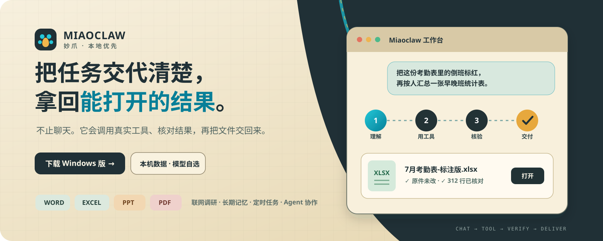
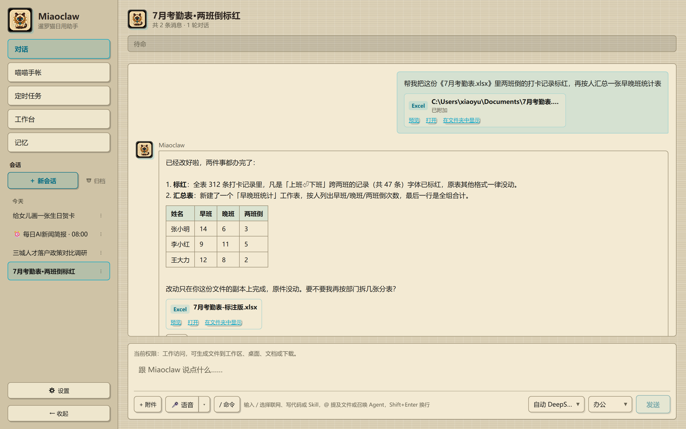

# 妙爪 Miaoclaw

**本地优先的 Windows AI Agent —— 直接把 Word / Excel / PPT / PDF 做完。**

最新：v3.2.2 · 免费软件 · 数据全在本机 · 模型你自选（DeepSeek / Kimi / GLM / Qwen 等 60+ 家）

[⬇ 下载 Windows 版](https://miao-claw.com/#download) · [📱 手机版](https://app.miao-claw.com) · [📖 使用说明](https://miao-claw.com/guide) · [💬 问题反馈](https://miao-claw.com/feedback)

<!-- miaoclaw-product-hero:start -->

  

<strong>聊清楚 → 用工具 → 核对 → 交付</strong>　数据留在本机，模型由你选择。

<!-- miaoclaw-product-hero:end -->

---

## 你交代事情，它交付结果

| 能力 | 一句话 |
|---|---|
| 📄 **办公文档** | 真的打开你电脑里的 Word / Excel / PPT / PDF 动手改：套模板、填公式、加批注；按「第几段/第几个表」精确定位，同一句话出现十次也不改错地方；原文件永不覆盖 |
| 👀 **做完自己看一眼** | 生成的 PPT / 文档会渲染出页面自查版式，发现问题自己修好再交 |
| 📑 **读 PDF 像人一样** | 两栏/三栏论文按正常阅读顺序读；页眉页码不混进正文；拼不出的表格诚实标注；扫描件本机离线 OCR |
| 🔎 **联网调研出成品** | 说一句话，分头搜集、交叉整理，交一份带对比表格的 Word/PDF 报告；老网站不乱码、网页广告导航自动剥掉 |
| 🧪 **模型能力靠实测** | 模型能不能看图，是真发一张图测出来的，不是抄文档；多把 Key 自动轮换，报错说人话 |
| 📱 **手机随时接上** | 扫码配对、端到端加密（中转服务器只见密文），任何网络可用；安卓 App + 浏览器双形态 |
| 🗒️ **日常小事** | 喵喵手帐随手记自动分类、定时任务到点自动跑、语音说话直接转文字（可离线）、桌面像素猫（可选） |

**为什么这些做得好？** 每一条背后的工程细节：[miao-claw.com/why](https://miao-claw.com/why)

## 真实交付，不是界面示意

上传 Excel，说一句话，Miaoclaw 会在副本中完成修改、核对结果，并把能直接打开的文件交回来。下图来自真实任务：312 行考勤逐项核对、两班倒标红、汇总表写回同一份交付文件。

  

## 更多真实界面

| 联网调研，成稿带对比表格 | 手机加密连回自己的电脑 |
|---|---|
|  |  |

| 随手记自动分类成手帐 | 定时任务到点自动跑 |
|---|---|
|  |  |
## 三步上手

1. **下载安装**：[官网下载](https://miao-claw.com/#download)（约 260MB，含全部运行时，双击一路下一步）；下载慢可用[百度网盘](https://pan.baidu.com/s/11cMkfjOXg8JsZOi39cy9PQ?pwd=v3bk)（提取码 v3bk）或本仓库 [Releases](https://github.com/FeixueCode/miaoclaw-releases/releases)
2. **贴一把 Key**：去 DeepSeek / Kimi 等官网领 API Key（约 5 分钟，多数厂商注册送额度），贴进设置或直接发到对话框
3. **直接说人话**：「把这份 Excel 里的加班记录标出来」「调研这个行业写份报告」——说就行

> 首次运行如遇「Windows 已保护你的电脑」：点「更多信息」→「仍要运行」。个人开发软件暂未购买代码签名证书，只从官网 / 网盘 / 本仓库下载即可放心。

### 3.2.2 更新亮点

- **这次有什么变化**：**归档会话更好管理**：归档区默认收起，打开后按页浏览；对话再多也不会一次铺满页面
- **你需要做什么**：在应用内检查更新即可：符合条件时会直接使用小体积更新；其他版本会直接下载 3.2.2 完整包，不需要先安装中间版本

完整更新说明见 [Releases](https://github.com/FeixueCode/miaoclaw-releases/releases/tag/v3.2.2)。

---

## English

**Miaoclaw** is a local-first AI assistant that lives on your own PC. It doesn't just chat — it opens your actual Office files and gets the work done.

Latest: v3.2.2 · Free · Local-first · Bring your own model key (60+ providers supported)

- **Real Office editing** — edits your existing Word/Excel/PPT/PDF with structure-aware addressing; originals never overwritten; renders its own output to self-review layout
- **PDF that reads like a human** — multi-column reading order, header/footer stripping, honest table extraction, fully offline OCR
- **Web research to finished reports** — charset sniffing, boilerplate stripping, hedged fetching
- **Model truth by live probing** — capabilities verified by real test calls, not docs; multi-key rotation
- **Phone access, end-to-end encrypted** — QR pairing, relay sees only ciphertext, works on any network

[Download for Windows](https://miao-claw.com/#download) · [English homepage](https://miao-claw.com/en/) · Note: UI is currently Chinese-first; English UI is on the roadmap.

---

## 关于本仓库

本仓库只存放**发布产物**（安装包、更新描述文件）。Miaoclaw 是安装在你自己电脑上的软件；AI 能力由你接入的模型服务商提供，费用与服务商直接结算，妙爪不经手、不抽成。

- 官网：[miao-claw.com](https://miao-claw.com) · 手机版：[app.miao-claw.com](https://app.miao-claw.com)
- 更新日志：[miao-claw.com/changelog](https://miao-claw.com/changelog)
- 问题反馈：[miao-claw.com/feedback](https://miao-claw.com/feedback) 或本仓库 [Issues](https://github.com/FeixueCode/miaoclaw-releases/issues)
