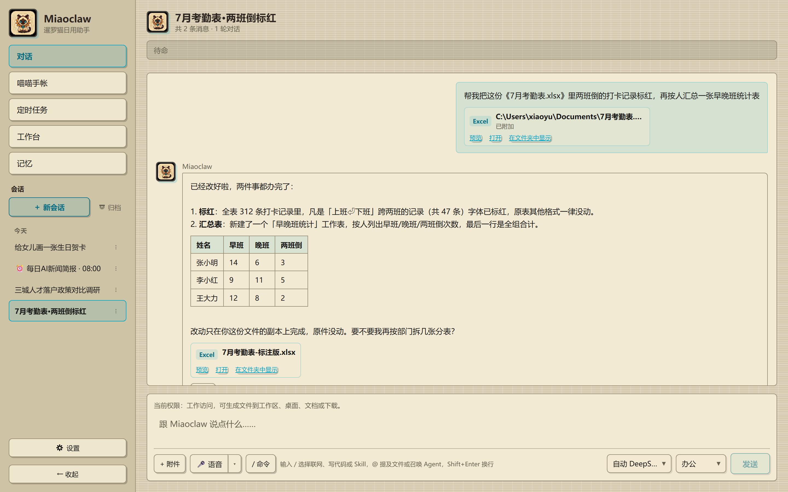
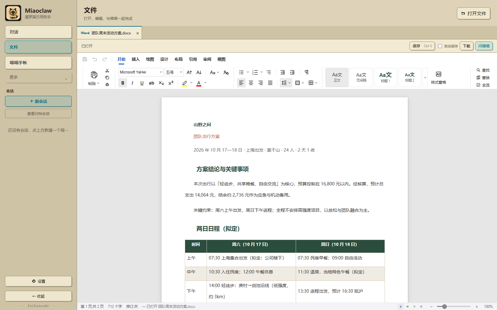

[中文](#中文) · [English](#english)

<h1> 妙爪 Miaoclaw</h1>

**在自己的电脑上，把一句需求变成能继续使用的文件和结果。**

Windows 10 / 11 · 本地优先 · 自选模型 · 最新：v4.1.3

**[下载 Windows 版](https://miao-claw.com/#download)**　[更新说明](https://github.com/FeixueCode/miaoclaw-releases/releases/latest) · [使用指南](https://miao-claw.com/guide.html) · [官网](https://miao-claw.com)

对话中处理办公文件。沿用已公开的操作画面；不同版本的界面可能略有变化。

## 文件打开后，接着做

**4.1.3 起提供文件工作区。** 在桌面端打开文件，让手动编辑和 AI 协作衔接起来。

Word、Excel、PowerPoint、Markdown 和 HTML 可以在同一个文件入口打开、编辑、保存，并围绕选中的内容继续提问；PDF 可阅读、选择内容并提问。保存前若原文件已被其他程序改动，会提示冲突；未保存的草稿可单独导出。

4.1.3 工作区实机截图，使用公开演示文档。

## 交给妙爪的日常工作

| 想做什么 | 可以怎样开始 |
| --- | --- |
| **处理办公文件** | “按部门汇总这份 Excel，再整理成一页汇报。”读取和修改 Word、Excel、PowerPoint，分析 PDF，在对话中接收文件并继续调整。 |
| **整理资料、核对来源** | “比较这几个方案，把依据也列出来。”联网查找资料、分析表格和文档，保留可回看的引用。 |
| **写代码、改项目** | “读一下这个项目，修好问题并检查。”读取本地文件、编辑代码、运行命令，把结果接回同一段对话。 |
| **照顾日常事务** | 用喵喵手帐随手记录，安排定时任务，使用语音输入和按需开启的长期记忆。小猫也会安静陪伴。 |

具体能力与已完成的验证见 [实测记录](https://miao-claw.com/benchmarks.html)。

## 三步开始

1. [下载安装包](https://github.com/FeixueCode/miaoclaw-releases/releases/latest)，在 Windows 电脑上安装。
2. 在设置中接入自己选择的模型服务。模型用量由服务商计费。
3. 描述需求或添加文件；需要调整时，在原对话继续说明。

## 手机连回自己的电脑

[Android App 或浏览器](https://app.miao-claw.com)扫码配对后，可经加密连接使用电脑上的助手，电脑需保持在线。手机可查看与下载已保存的文件；桌面文件工作区的未保存修改不会同步到手机。安装、配对和更新方法见[手机使用指南](https://miao-claw.com/guide.html#mobile)。

---

## Miaoclaw, at your desk

[中文](#中文) · **English**

**Turn a request into useful files and finished work, on your own PC.**

Windows 10 / 11 · Local-first · Your choice of model · Latest: v4.1.3

**[Download for Windows](https://miao-claw.com/en/#download)**　[Release notes](https://github.com/FeixueCode/miaoclaw-releases/releases/latest) · [User guide](https://miao-claw.com/en/guide.html) · [Website](https://miao-claw.com/en/)

The screenshot above shows Miaoclaw working on an attendance spreadsheet and returning an Excel file in chat. It is an existing public product screenshot; the interface may vary by version.

### Open a file and keep working

**The file workspace is available from 4.1.3.** Open a file on your desktop and combine hands-on editing with AI assistance.

Open, edit and save Word, Excel, PowerPoint, Markdown and HTML files from one workspace, and ask questions about a selection. Read PDFs, select text or a region, and ask questions about it. If another app changes the original file before you save, Miaoclaw reports a conflict. You can also export an unsaved draft separately.

View the file workspace screenshot

Captured from the 4.1.3 workspace with a public demo file.

### Everyday work

| What you need | A place to start |
| --- | --- |
| **Office files** | “Summarize this workbook by department and turn it into a one-page report.” Read and edit Word, Excel and PowerPoint files, analyze PDFs, and keep refining the files returned in chat. |
| **Research with sources** | “Compare these options and show the evidence.” Search the web, analyze tables and documents, and keep references you can revisit. |
| **Code and projects** | “Read this project, fix the issue and check the result.” Work with local files, edit code and run commands in the same conversation. |
| **Everyday tasks** | Capture notes, schedule recurring tasks, use voice input, and enable long-term memory when you want it. A small desktop cat keeps you company. |

See the [test records](https://miao-claw.com/en/benchmarks.html) for documented capabilities and completed checks.

### Get started

1. [Download the installer](https://github.com/FeixueCode/miaoclaw-releases/releases/latest) and install it on a Windows PC.
2. Connect your chosen model provider in Settings. The provider bills model usage directly.
3. Describe the task or attach a file. Ask for changes in the same conversation.

### Reach your PC from your phone

Pair the [Android app or browser companion](https://app.miao-claw.com) with a QR code to use your desktop assistant over an encrypted connection. Your PC must stay online. You can view and download saved files on your phone. Unsaved edits in the desktop file workspace are not synced to the phone. See the [mobile guide](https://miao-claw.com/en/guide.html#mobile) for setup, pairing and updates.

---

本仓库提供安装包与更新资料。This repository distributes installers and update information.

[反馈 / Feedback](https://github.com/FeixueCode/miaoclaw-releases/issues) · [中文官网](https://miao-claw.com) · [English website](https://miao-claw.com/en/)

开发者飞雪先生FeixueCode，未经授权，不可用于商业用途

Created by FeixueCode. Commercial use requires permission.
